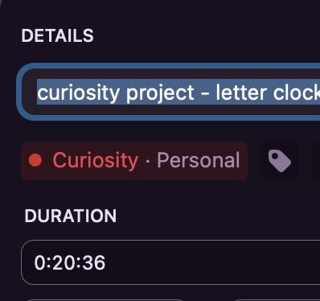

Cursor is insane, I've written < 5 lines of swift in my life and literally took 20 minutes


anyways. quick clock to try my new base64 time format. 

# Letter Clock - macOS Menu Bar App

A simple macOS menu bar application built with Swift and AppKit.

## Features

- **Menu Bar Integration**: Appears as a clock icon in your menu bar
- **Show Time**: Display current date and time in a dialog
- **About Dialog**: Information about the app
- **Clean Interface**: Minimal, native macOS design

## How to Run

### Option 1: Install as macOS App (Recommended)
1. **Build the app**:
   ```bash
   ./build_app.sh
   ```

2. **Install to Applications**:
   ```bash
   ./install.sh
   ```

3. **Add to Login Items**:
   - Open System Preferences > Users & Groups > Login Items
   - Click '+' and add 'Letter Clock' from Applications
   - The app will now start automatically when you log in

### Option 2: Development Mode
1. **Build and Run**:
   ```bash
   swift run
   ```

2. **Or using Xcode**:
   - Open the project in Xcode
   - Build and run directly

## Usage

1. Look for the clock icon in your menu bar
2. Click on it to open the dropdown menu
3. Select "Show Time" to see the current date and time
4. Use "Quit" to exit the app (or press ⌘Q)

## Architecture

- **Swift + AppKit**: Native macOS integration
- **NSStatusBar**: Standard menu bar functionality
- **No external dependencies**: Uses only system frameworks

The app runs as an accessory application (doesn't appear in the dock) and provides a clean, native macOS experience. 